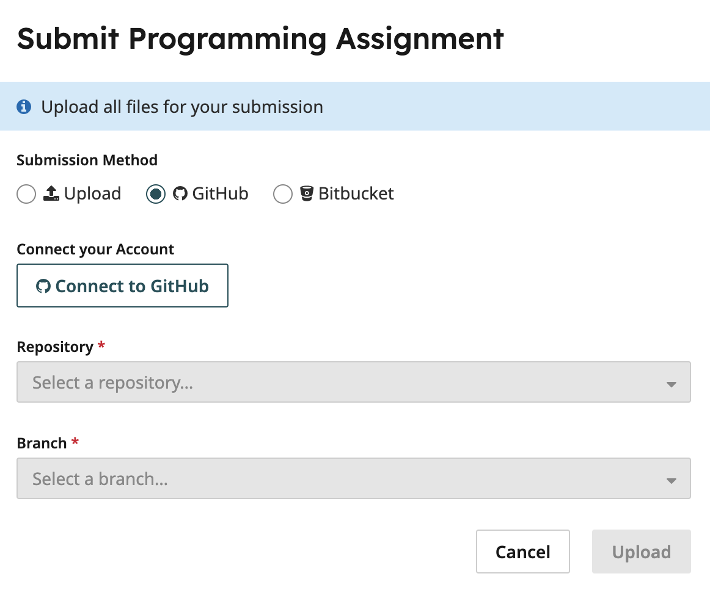

# Problem Set 0

## Installation

It's **highly** recommended to use `uv` for this course, especially if you are not familiar with managing multiple python installations or are uncertain about which version of Python is currently installed on your system.

### `uv`

#### Installing `uv`

A headache-free way to start running the starter code is via the [`uv`](https://docs.astral.sh/uv/getting-started/installation/) package manager. To install (on Mac, Linux, WSL):

```
curl -LsSf https://astral.sh/uv/install.sh | sh
```

> [!NOTE]
> The above command requires `curl` installed! You'll most likely have this installed, already but if not it should be a small `brew/apt/pacman install` away. Alternatively, if you have `wget` already installed you can use
>
> ```
> wget -qO- https://astral.sh/uv/install.sh | sh
> ```

Alternative approaches exist to install `uv` which you are invited to explore in the [Astral documentation](https://docs.astral.sh/uv/getting-started/installation/).

#### Installing Project Dependencies

One of the major superpowers of `uv` is its ability to manage different versions of Python using a combination of virtual environments and configuration files. Initialize this project's virtual environment using

```
uv venv
```

and then install all the required dependencies using

```
uv sync
```

This should install an appropriate Python version and all the project's dependencies including `pytest`.

#### Running the code

To run the provided tests (or ones you created):

```
uv run pytest
```

> [!NOTE]
> No sourcing required! If you prefer the virtual environment folder to not be called `.venv` then you can pass a name to the `uv venv` command. However, this would require setting the `UV_PROJECT_ENVIRONMENT` variable to this name either prior to every `uv sync` and `uv run` command, exporting the variable in every terminal session, or using some external dependency to manage your environment variables like [`direnv`](https://direnv.net/).

### "Manual" Virtual Environment Management

#### Setting up your environment & Installing Dependencies

If you prefer not having to install another package manager, then you can choose to use a currently installed Python interpreter and configure your virtual environment manually. It's recommended to use a Python interpreter with version 3.11+, although it should be possible to run the stencil with a 3.10 interpreter. This may require making edits to the type hints provided in the stencil.

To setup your virtual environment we provide a setup script at `scripts/setup.sh`.

```bash
chmod +x scripts/setup.sh
./scripts/setup.sh
```

#### Running the code

Be sure to source your virtual environment!

```bash
source .venv/bin/activate
```

> [!TIP]
> You should see `(.venv)` next to your terminal prompt when your environment is successfully sourced. Alternatively, you can verify if the environment is sourced by running `which python3`. This path should point to the location of your virtual environment.

To run the starter code use:

```
python3 -m segmentation [--help] [--world WORLD] [--agent-one AGENT_ID] [--agent-two AGENT_ID] [--headless] [--render-delay]
```

To run the provided tests (or ones you created use):

```
pytest
```

## Submitting

We will be using Gradescope to automatically grade the programming assignments for the course. To submit to Gradescope push your code to GitHub, select the appropriate Gradescope Assignment and then select your GitHub repository.


