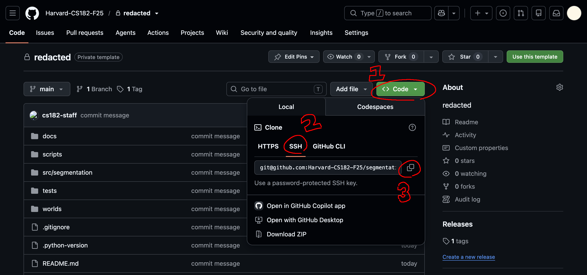
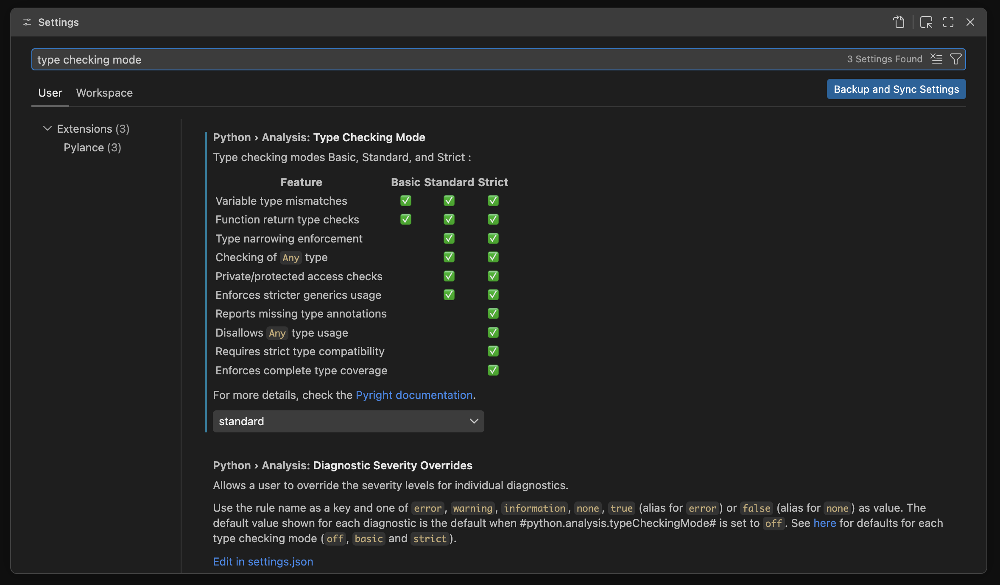
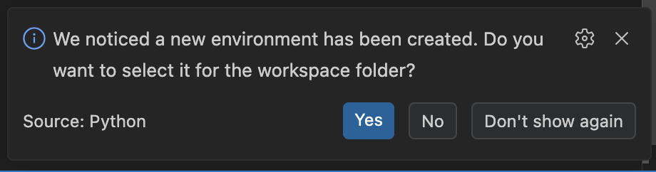
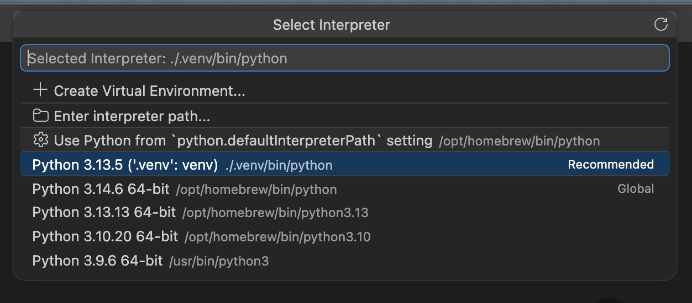

<!--
========================================================================================================================

    This is a Markdown file. If you're using VS Code, right-click the filename and select "Open Preview" to render it!

========================================================================================================================
-->

# Installation

| [`README`](../README.md#cs-1820-problem-set-0) | [`Installation`] | [`Getting Started`](2-getting-started.md#getting-started) | [`Tasks`](3-tasks.md#tasks) |
| :---: | :---: | :---: | :---: |

<br>

For this class, you will be using GitHub, Git, Visual Studio Code, and `uv` in order to fetch and work on programming assignments. We assume that most students will be using VS Code, but other IDEs should be fine. Feel free to skip any steps that you have done before, or post on [Ed](TODO) if you get stuck.

<br>

## GitHub and Git

### Creating a GitHub account

In this class, we will use GitHub Classroom to distribute code and manage submissions to Gradescope. GitHub is a cloud-based platform which stores *repositories* (or *repos* for short), which are special folders that track the complete history of a project. If you haven't already, you'll want to start by making a [GitHub account](https://github.com/) using your Harvard email.

### Installing Git

Git is a program which you can think of as your local interface for communicating with GitHub. (You can find more information about why Git is useful in the [`Getting Started`](2-getting-started.md#more-about-git) page.) First, check if your computer already has Git by executing the following command in your terminal.

```sh
git --version
```

If you see the version printed out, you can move on to configuration. Otherwise, you will need to install Git. If you are on Mac, you should see a popup which will take you through the installation. If no popup appears, you can alternatively execute `xcode-select --install` in your terminal. If you are on Windows, you can download and run a standalone installer from [the official page](https://git-scm.com/install/windows). After installing Git, verify that `git --version` works as intended.

> [!tip]
> The primary way to access Git is through a piece of software called a *terminal*, also known as a *command-line interface*. If you are on Mac, you can find the `Terminal` app by opening Spotlight Search (`Cmd` + `Space`), typing `Terminal`, and pressing `Return`. If you are on Windows, you can find the `Command Prompt` app by pressing the `Windows` key, typing `cmd`, and pressing `Enter`.

### Configuring Git

You'll also want to tell Git your name and email. Then, anyone who pulls your code from GitHub will know that you wrote it. Ideally, you should use your real name and your Harvard email. Execute the following two commands in your terminal.

```sh
git config --global user.name "<your-name>"
git config --global user.email "<your-email>"
```

> [!tip]
> Angle brackets `<>` are a common convention in code documentation. They signal that you should replace the text enclosed, along with the brackets themselves, with your own inputs. In the above, you *should* include the quote marks, but you should *not* include the angle brackets.

### Configuring your SSH key

Since GitHub repositories live on remote servers, whenever you make changes to a repo from your local computer, GitHub needs to make sure that you are authorized to access that repo. In other words, you need to prove your identity by connecting your machine to GitHub. The best way to do this is to use an *SSH key*, a secret key that defines your identity, and an *SSH agent*, a program that remembers your identity.

SSH keys are extremely secure, and more importantly, you won't need to type your password all the time. You can set up your SSH key by following [the official instructions](https://docs.github.com/en/authentication/connecting-to-github-with-ssh) for your operating system. Make sure you test your SSH connection! The whole process is a bit tedious, but once you set it up, you can forget about it. If you are having trouble with this step, please ask for help.

### Cloning your repository

With GitHub and Git set up, you can now download the assignment onto your computer. First, you will need to choose a folder to download it in. We suggest creating a `cs1820` folder (e.g., inside your `Desktop` folder) to store your assignments. In a new Terminal window, you can execute the commands below to create and navigate into this folder.

```sh
cd Desktop      # [c]hanges [d]irectory to Desktop
mkdir cs1820    # [mk]es a new [dir]ectory called cs1820 inside Desktop
cd cs1820       # [c]hanges [d]irectory to cs1820
```

Now, to download the assignment:

1. Open your unique repo's webpage in your browser.
2. On the GitHub page, click the green `Code` button, select `SSH`, and copy the URL.
3. Open Terminal and navigate into the folder that you want to download the assignment in.
4. Execute the following command (without the angle brackets `<>`).

```sh
git clone <copied-url>
```

You should verify that the cloned repo has appeared in your desired folder.

<figure style="text-align: center;">
    
</figure>

<br>

## Visual Studio Code

### Installing VS Code

Visual Studio Code is a popular *integrated development environment* (IDE) developed by Microsoft. IDEs are pieces of software that make writing code much nicer. In this class, we will assume that most students are using VS Code. Follow the instructions in [the official docs](https://code.visualstudio.com/docs/getstarted/overview#_install-vs-code) to set it up on your computer.

### Downloading the Python extension

VS Code is notable for its large library of official and community-made extensions, which extend its functionality and language support. In our case, we need language support for Python. Within VS Code, navigate to the Extensions tab in the left sidebar and install [Python](vscode:extension/ms-python.python "Open in VS Code") from Microsoft.

### Opening your cloned repository

From a new VS Code window, click `Open` and locate your cloned repo. Select `Yes` if you are asked whether you trust the authors of the project. You should now be able to navigate the repo using the Explorer on the left. In the `docs` folder, you'll find the file you're reading right now! We'll start running scripts later. For now, to view rendered Markdown files, right-click a `.md` file and select `Open Preview`.

> [!note]
> VS Code includes an integrated terminal, which you can open by selecting `Terminal` → `New Terminal` in the app menu bar at the top. Conveniently, this terminal automatically opens inside your project folder, and it lets you keep your terminal in the same window as your code.

### Enabling type checking

This step is optional, but we recommend that you enable typed Python. By letting VS Code automatically check that your variables and functions align with the given type rules, your experience programming (and especially, debugging) can potentially be much smoother. To enable type checking:

- Open the settings (`Ctrl`/`Cmd` + `,`).
- Search for [`Type Checking Mode`](vscode://settings/python.analysis.typeCheckingMode) and find the Python setting.
- Set it to your desired level of strictness. (We recommend `standard` as a good default.)

<figure style="text-align: center;">
    
</figure>

<br>

## `uv`

### Installing `uv`

`uv` is a Python package and project manager developed by Astral. Compared to other similar software, `uv` has the advantages of being very fast and making it simple to start running code. We recommend installing it directly in your terminal, using a standalone installer from [the installation page](https://docs.astral.sh/uv/getting-started/installation/). There are other installation methods on the same page, which you are encouraged to explore. You can verify your installation by executing the following.

```sh
uv --version
```

### Installing project dependencies

One major superpower of `uv` is that it automatically manages different versions of Python and all project dependencies, using virtual environments and configuration files. To initialize this project's virtual environment and install all the required dependencies, open your cloned repository in VS Code, and execute the following command in an integrated terminal.

```sh
uv sync
```

This will install an appropriate Python version (3.13) and all dependencies, including our testing framework `pytest`. You should see a `.venv` folder appear in the Explorer.

### Selecting your Python interpreter

After executing `uv sync`, you might see a popup in the bottom right like the following. Click `Yes` so that VS Code can resolve your project's dependencies.

<figure style="text-align: center;">
    
</figure>

If you don't see this popup, you can manually select your Python interpreter as follows.

- Open the Command Palette (`Ctrl`/`Cmd` + `Shift` + `P`).
- Type and select `Python: Select Interpreter`.
- Choose your repo's virtual environment. This will most likely be the interpreter recommended by VS Code.

<figure style="text-align: center;">
    
</figure>

For your environment to be detected, make sure that your opened folder in VS Code is indeed your cloned repo!

### Using `uv`

To run any Python script, you can now simply use `uv run <your-script>`, and `uv` will automatically verify that your virtual environment is up-to-date and run your script using this environment. If everything has gone right, then you should be able to execute the following command. Several tests will initially fail because the required functions begin unimplemented.

```sh
uv run pytest
```

<br>

---

| [← `README`](../README.md#cs-1820-problem-set-0) | [`Back to top`](#installation) | [`Getting Started` →](2-getting-started.md#getting-started) |
| :--- | :---: | ---: |
